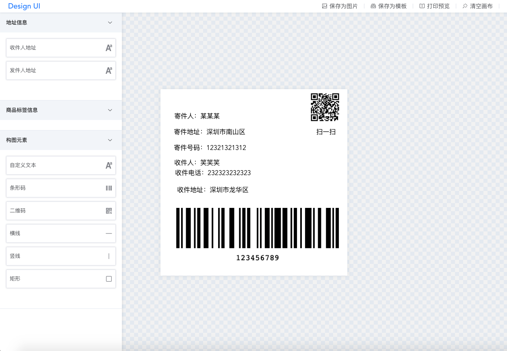

# manifest-design
A label template design system based on vue

English | <a href="./README.md">简体中文</a>

### preview
https://sxx19950910.github.io/manifest-design/

### benefit
1.Componentization 
2.Drag and drop design 
3.Scalable 
4.Dynamic preview 
4.Save To Image 
5.Save To Template 
## one stop
git clone https://github.com/SXX19950910/manifest-design.git  

cd manifest-design 

npm i 

npm run dev

### Log
2020-12-23 
1.修复窗口尺寸变更而导致的bug 
2.新增组件栏宽度设置功能 
3.支持lodop预览与打印 
4.优化打包 

2020-12-24 
1.修复模板保存的BUG 
2.修复快速打印的BUG 
3.修复打印预览的显示问题 
4.新增退格键删除功能 
5.新增纸张尺寸设置功能 

2020-12-25 
1.优化加载过程 
2.修复滚动后产生的BUG 

2020-12-30 
1.修复快速打印预览的BUG

## build
npm run build
